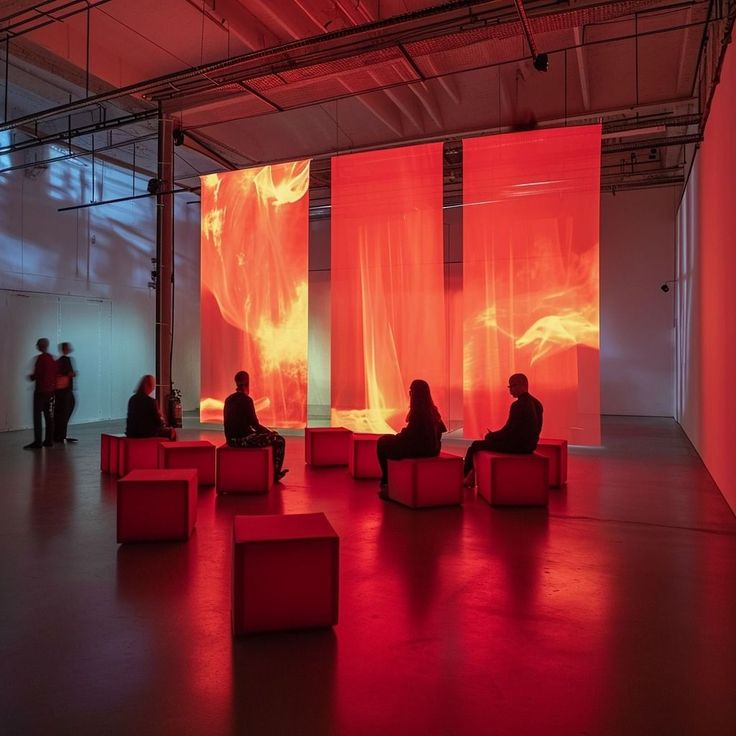
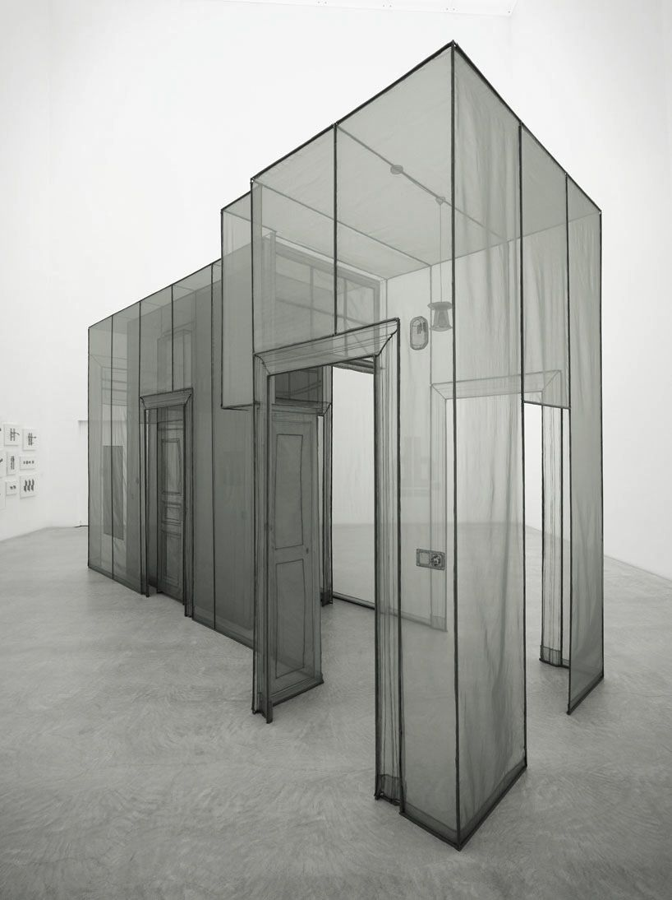

# Kostas KATKEVICIUS and Maria SARAFI
## Suitscapes
In <i>Suitscapes</i> the user shuffles through the history of suits, exploring their associations with the seasons, the elements, and human emotions. 

The main objectives of the suitscapes project are: - make more specific!!!!
- Create an immersive audiovisual experience
- Learn about facts and suits symbolism in an entertaining way

### Core Interactions - IN PROGRESS - less interactions

- Blow a card to open a deck, to "catch" the air and the fire elements
- Facial expressions recognition: mouth and eyes recognition while immitating projected emotions
- Grab / Pick gesture to catch the water and the earth elements

 

     

 

### User Journey
#### Content
- 4 Decks: Latin - Italian, Swiss-German (Jass), French and Hanafuda. We decided to integrate Hanafuda instead of Tarot, although it's not a 4-suits but a 12-suits card game (the 12 months of the four seasons), in order to present a non-european deck, with a less anthopocentric approach, and show that there are also different systems of suits
- Facts: Geographical origins, creation period, materiality, characteristics, fun facts, contemporary approach
- "Myths": seasons, natural elements and emotions symbolism  
- Chronological aspect: we are covering 4 different decks, representing quite different periods of time, based on their origins. We are not covering the whole chronological evolution of each deck and it's suits.

#### User Journey - IN PROGRESS OK 
When visitor enters the system starts (is this considered an interaction)
0. Visitor(s) enter -> Card shuffle sound starts
1. A tree appears with its roots getting bigger
2. A Latin (Italian) card appears on the central projection at the top of the tree with its roots expanding, showing a Hanafuda card on the left and Jass and French cards on the right at the bottom of the roots. We see the corresponding back side of the cards
3. The user is asked to blow a card ("Blow a card and see where the adventure takes you")
4. The system has to recognize the blow
5. The user enters into the specific card deck landscape starting with the spring season -> Spring sounds start, animals part of the landscape make a sound and get animated 
6. The visitor is greeted by a card, who shares some general deck information and shares how they feel. 
7. The card asks the user to immitate their facial expression of emotion.
8. The system has to recognize the facial expression; if successfull -> animation and sound / song
9. The corresponding season suit appears and introduces themselves, giving some additional facts.
10. A mini-game starts: the visitor has to catch the natural element that appears in 10 sec. 
11. The suit tracks the hand motion. 
12. In case of the air and fire elements they have to blow in the case of water and earth they have to make a closed fist gesture (grab) to catch it. ! To check if finally it's going to be Pick.
13. The system has to recognize the hand gesture.
14. After catching it we move to the next season and deck, based on the chronological order we defined -> animation and sound.
15. Steps 5 to 13 repeat three times until we completed 4 seasons with 4 different decks.
16. All suits friends parade to say goodbye - suits overview.

### Installation
- 3 projectors, 3 motion-tracking webcameras ! Is there a max camera angle for having accurate results if camera not if front but with an angle with the appropriate training? (camera with wide angle lens)
- 4th webcamera on top for the hand gestures
- Projection 270 degrees on fabric
- User in standing position
- Up to 3 "players" (3 projections)

Our Moodboard: 
 

     

 

Examples for our Installation:
 

     
     
    

 
