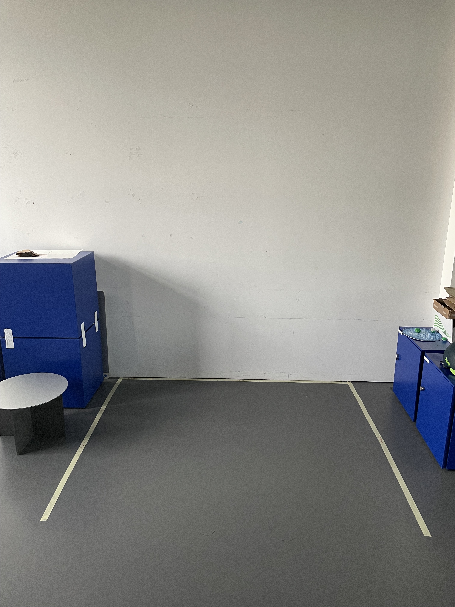
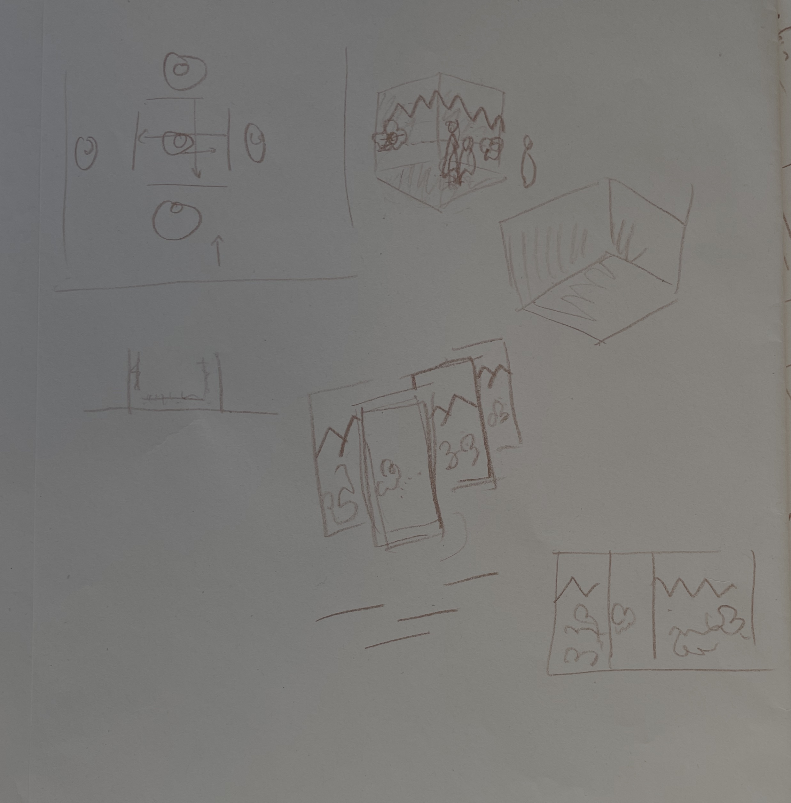
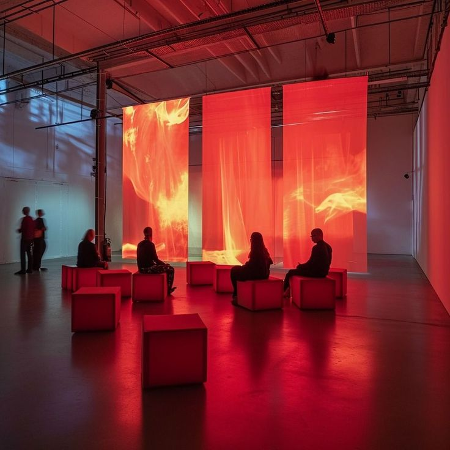
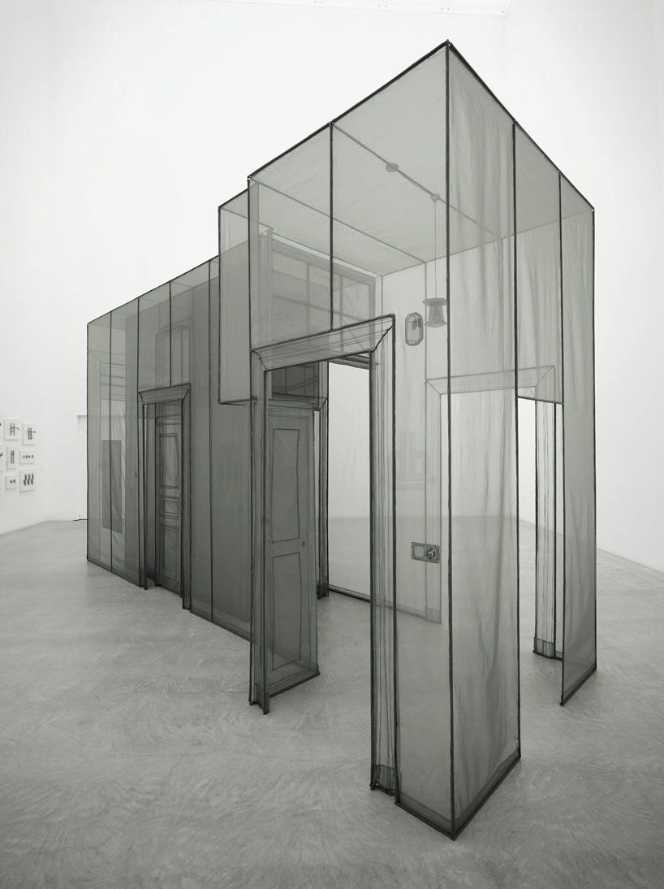

# Kostas KATKEVICIUS and Maria SARAFI
## Suitscapes
In <i>Suitscapes</i> the user shuffles through the history of suits, exploring their associations with the seasons, the elements, and human emotions. 

The main objectives of the suitscapes project are: - TO MAKE MORE SPECIFIC
- Create an immersive audiovisual experience
- Learn about facts and suits symbolism in an entertaining way

### Core Interactions - SEE ALSO USER JOURNEY

- Blow a card to open a deck; blow-like gesture for spring to express love (blow a kiss)
- Facial expressions recognition: mouth and eyes recognition while immitating projected emotions
- Grab / Pick gesture to catch the earth element
- "Jump" / walk on the water in case of the water element
- Duck to avoir the air element
- The suit of the season tracks the hand motion; in case of fire move the hand away from the fire

### User Journey
#### Content
- 4 Decks: Latin - Italian, Swiss-German (Jass), French and Hanafuda. We decided to integrate Hanafuda instead of Tarot, although it's not a 4-suits but a 12-suits card game (the 12 months of the four seasons), in order to present a non-european deck, with a less anthopocentric approach, and show that there are also different systems of suits
- Facts: Geographical origins, creation period, materiality, characteristics, fun facts, contemporary approach
- "Myths": seasons, natural elements and emotions symbolism  
- Chronological aspect: we are covering 4 different decks, representing quite different periods of time, based on their origins. We are not covering the whole chronological evolution of each deck and it's suits.

#### User Journey

0. Visitor(s) enters (motion tracking) -> Card shuffle sound starts
1. A tree appears with its branches getting bigger
2. A Latin (Italian) card appears on the central projection of the tree with its branches expanding, showing a Hanafuda card, Jass and French cards on the branches like leaves. We see the corresponding back side of the cards
3. The user is asked to blow a card ("Blow a card and see where the adventure takes you") and the card-leaf falls.
4. The system has to recognize the blow
5. The user enters into the specific card deck landscape starting with the spring season -> Spring sounds start, animals part of the landscape make a sound and get animated 
6. The visitor is greeted by a card, who shares some general deck information and shares how they feel. Do we integrate directly the person on the card or the card as a whole? 
7. The card asks the user to immitate their facial expression of emotion.
8. The system has to recognize the facial expression; if successfull -> animation and sound / song
9. The corresponding season suit appears and introduces themselves, giving some additional facts.
10. A mini-game starts with the corresponding element: the visitor "is playing" for 10 sec
11. The suit tracks the hand motion. 
12. In case of fire the user tries to avoid it moving the hand away of it, in case of earth they catch it with a closed fist gesture/pick it with the thumb and index pointers (depends on the implementation), in case of water the user "jumps" / walks inside the water (motion tracking), in case of air the user ducks to avoid the air blowing over their head.
13. The system has to recognize the hand gesture.
14. After catching it we move to the next season and deck, based on the chronological order we defined -> animation and sound.
15. Steps 5 to 13 repeat three times until we completed 4 seasons with 4 different decks.
16. All suits friends parade to say goodbye - suits overview.

### Installation - TO BE REVIEWED
We simulated today the available museum space, based on the museum plan (approximately, because exact dimensions are not mentioned on the floor plan). The width is around 1,50 m + 0,25 m if we add some extra space in front of the door. The depth is around 1,50 m. 

 

     

 

We did discuss with Laure Tuesday, 28 october, about the installation - see following ideas

 

     

 

TO DO - We have TO REVIEW following installation points based on the simulation, the discussion with Laure and after finalizing our Core Interactions list.

- 3 projectors, 3 motion-tracking webcameras ! Is there a max camera angle for having accurate results if camera not if front but with an angle with the appropriate training? (camera with wide angle lens)
- 4th webcamera on top for the hand gestures
- Projection 270 degrees on fabric
- User in standing position
- Up to 3 "players" (3 projections)

 

     
     
    

 