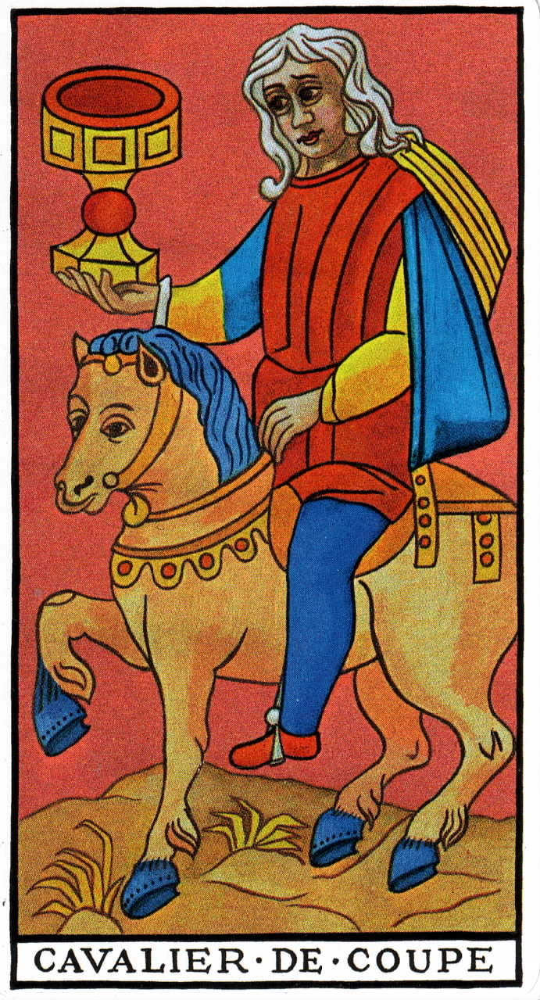
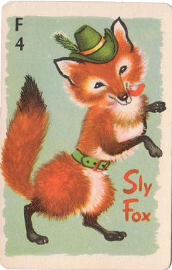
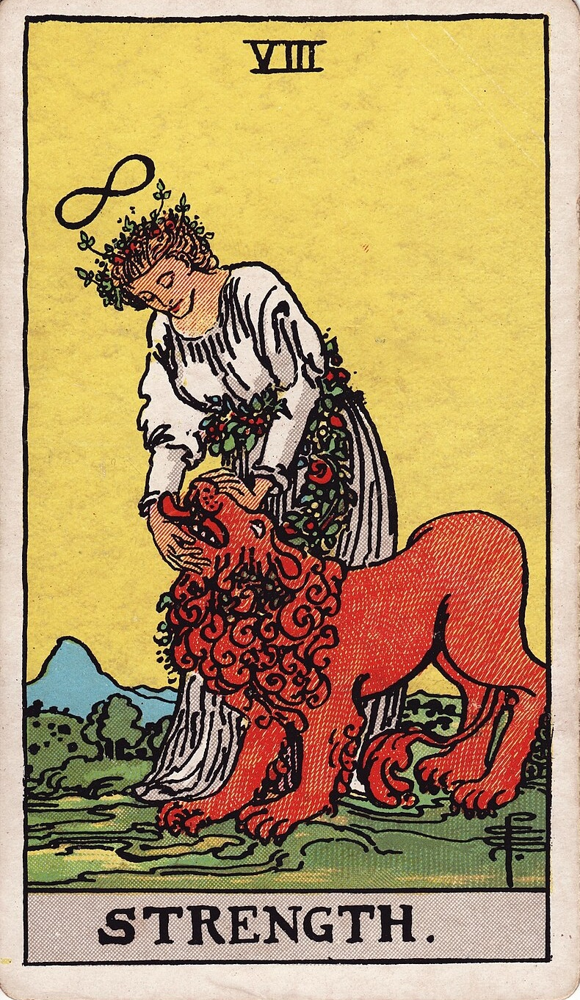
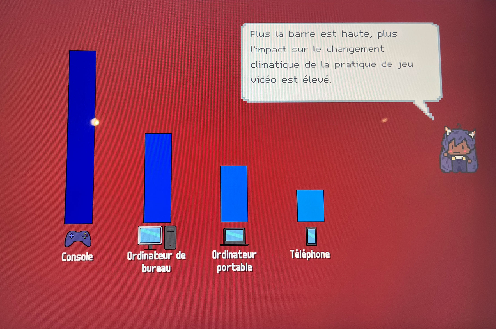
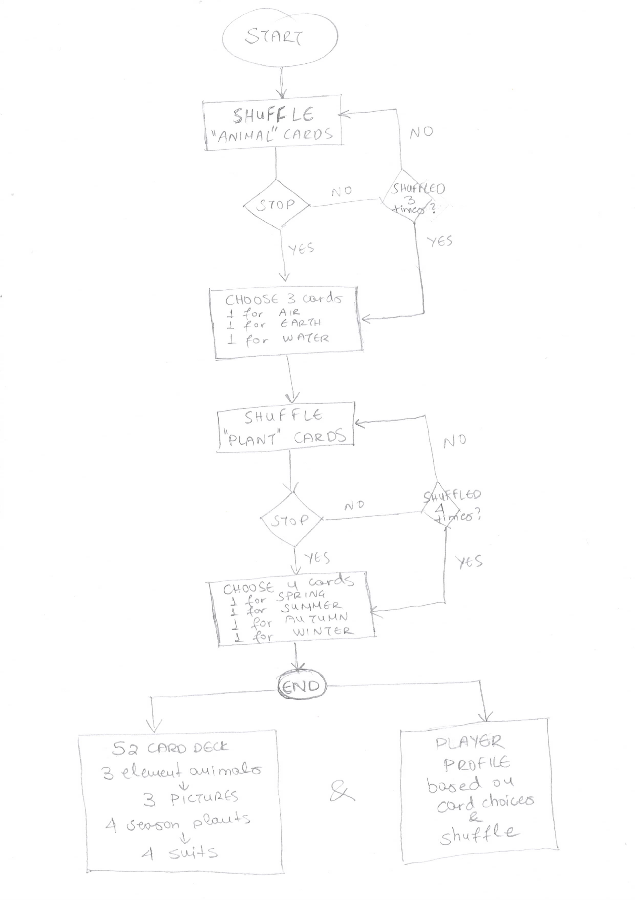
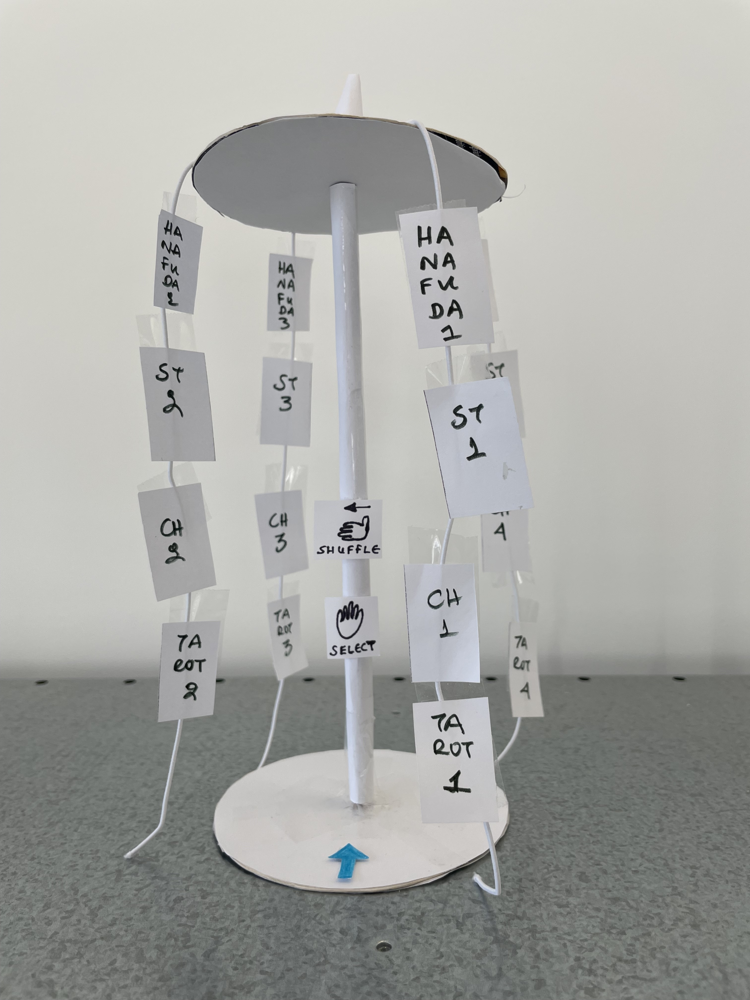
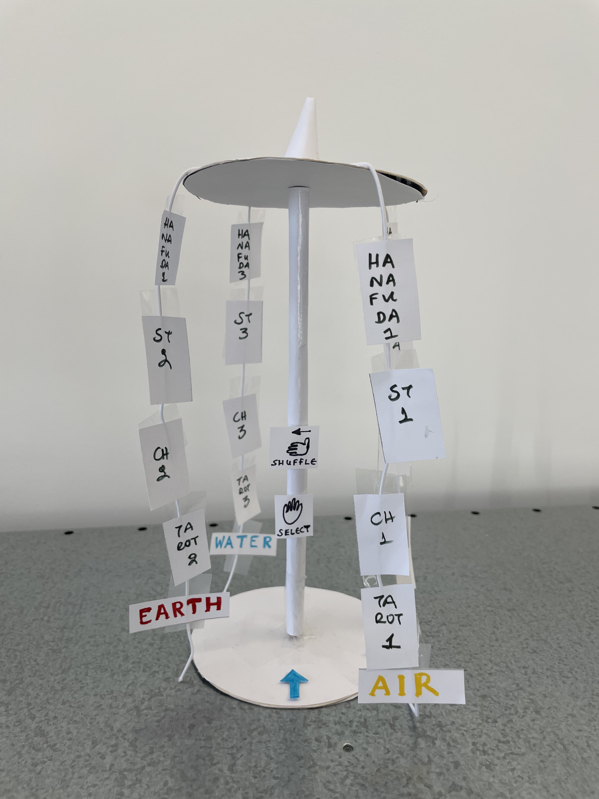
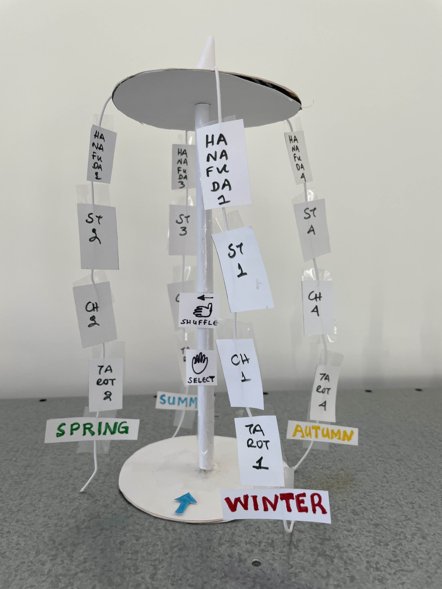
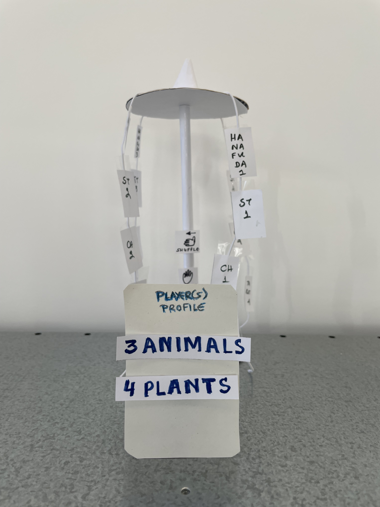
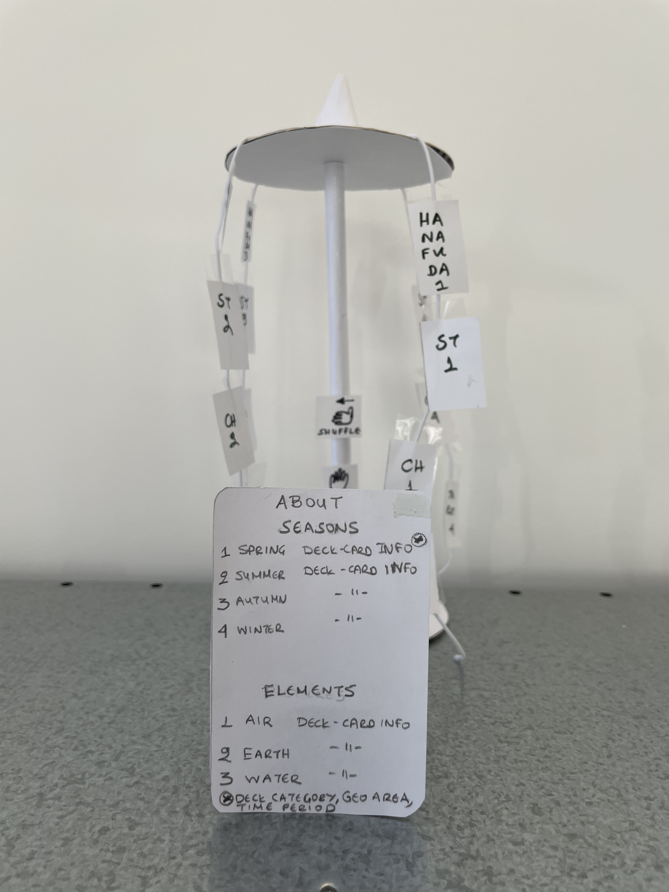

# Maria SARAFI
## Research 
My research examines how <b>nature-themed playing cards</b>, especially those featuring <b>animal motifs</b>, have evolved across cultures and time periods (<i>[Nature - Bestiary Cards Dataset](https://drive.google.com/file/d/1DHTS5pODCRAs6sN-34fva-bKjNU4pooS/view?usp=share_link)</i>). I focus primarily on

- the historical development of Japanese card games, tracing their origins from 8th-century precursors through to the emergence of 19th- and 20th-century Hanafuda decks with variations present also in Korea and Hawaii,
- the European card decks, with particular attention to the evolution of Tarot (Tarot de Marseille, Rider–Waite Tarot, and contemporary variations), especially the distinct designs and artwork of Major Arcana or Trump cards,
- animal-themed card games for children aged 6+

In parallel, I try to identify the <b>main patterns of card game mechanics</b> based on the above-researched games and my personal card game experience and observations. 

In addition, both <b>accessibility and ecological footprint</b> are important parameters for my project to consider.

### Insights
1. <b>Humans and Nature.</b> Early playing cards (China, India, Mamluk deck) often carried symbolic imagery, including birds, flowers, and animals, as they were easier to recognize across cultures and social classes. When cards spread to Europe in the 14th century, animals symbolized specific virtues, and fate. In the 17th–18th centuries, educational and moral card games were common, like <i>[Aesop’s Fables Cards](https://www.wopc.co.uk/uk/aesop’s-fables)</i>. Decks often depicted plants, animals, or natural scenes to teach children about zoology, botany, or moral lessons.

2. <b>Animal Symbolism and Cultural Representation.</b> While in Hanafuda decks there is a nature focused approach in representing nature and animals - there is only one card whith human presence - in the European decks the approach is more anthropocentric.

<!-- does not work in Github

  
   
  <em>Hanafuda Deck</em>

-->

  
   
  <em>Hanafuda Deck</em>

 

  Animals in European cards are presented often as human companions or working animals, or are attributed specific anthropological characteristics or symbolic meaning.

<!--

  <figure style="text-align: center;">
    
    <figcaption>Tarot de Marseille - Cavalier de Coupe</figcaption>
  </figure>

  <figure style="text-align: center;">
    
    <figcaption>Rummy Card Game - Sly Fox</figcaption>
  </figure>

  <figure style="text-align: center;">
    
    <figcaption>Rider–Waite Tarot - Strength</figcaption>
  </figure>

-->
|  |  |  |
|:-------------------------------:|:-------------------------------:|:-------------------------------:|
| *Tarot de Marseille - Cavalier de Coupe*                     | *Rummy Card Game - Sly Fox*                     | *Rider–Waite Tarot - Strength*                     |

  Animals can make a game more appealing not only aesthetically, but also in terms of relatability. For instance, in modern trading card games, creatures inspired by real or mythical animals make the game more immersive and engaging. 

3. <b>Seasons and the basic elements.</b> By 1582, the Gregorian calendar was largely adopted by Europe, so playing cards began to correlate with the year, the seasons, and the solstices. The four suits represent the four seasons/solstices or the four phases of the moon. Suits may also parallel the four elements found in nature: hearts for water, clubs for fire, diamonds for earth and spades for air. The twelve royals (King, Queen, and Jack), represent the twelve months of the year, each suit of thirteen cards represents the thirteen weeks in each season (<i>[The Symbology of Playing Cards](https://www.artofplay.com/blogs/stories/the-symbology-of-playing-cards?srsltid=AfmBOoonOhSUILE-3qeU7HGa4MdvMwQP87YsS96Nl5cIul76PCY0DUE3)</i>). 

  Hanafuda cards were designed during the Edo period in Japanese history (1603 – 1868). Before 1873 and the adaptation of the Gregorian calendar, the Japanese calendar was based on the Chinese solar-lunar calendar, which took into account the movements of both the Earth around the Sun, and the Moon around the Earth. An advantage of the solar-lunar calendar was that people could tell the date by just observing the moon and sun. Hanafuda cards are organized in twelve suits that correspond to months of the year, each month represented with a flowering plant (
  <a href="https://hanafudahawaii.com/2025/03/10/symbols-and-motifs-in-hanafuda/" target="_blank"> <i>Symbols and Motifs in Hanafuda</i></a>).

4. <b>Stop or Continue Concept.</b> Card game rules define when a player can continue playing in a specific round or has to stop. They also define when a game is considered completed. There are games where the player is the one choosing to stop and score, or continue and risk, like in Blackjack by hitting for an additional card or in Koi-Koi (the homonymous Japanese Hanafuda card game), by continuing playing (koi-koi).

5. <b>Accessibility.</b> Card games present various accessibility - inclusivity issues, which can affect players with visual impairments (<i>[Game accessibility for visually impaired people: a review](https://link.springer.com/article/10.1007/s00500-024-09827-4)</i>), cognitive disabilities, or motor challenges. In addition, as mentioned during the Museum of Games presentation accessibility has not been fully addressed.

6. <b>Ecological Footprint (EF).</b> To assess the environmental impact of a product or service based on the life cycle assessment (LCA) method, the environmental impact of a product or service is computed at each step of its life cycle (extraction of materials needed, manufacturing, distribution / transport to the customer, use, end of life) - See <i>[The environmental impact of video and board games](https://gamelab-lausanne.ch/the-environmental-impact-of-video-and-board-games/#:~:text=Materials%20are%20needed%20to%20build,well%20as%20transmit%20the%20data)</i>.

<!-- dores not work in GitHub>

  
   
  Museum of Games - Ecological Footprint Game for Children

-->

  
   
  <em>Museum of Games - Ecological Footprint Game for Children</em>

## Koi-Koi

Koi-koi is an interactive experience where the player explores the history of animal- and nature-themed cards, including Hanafuda decks and their precursors, Tarot, standard decks, and children's card games. The player first selects three animal cards, each representing one of the primary animal environments: air, earth, and water. Next, the player chooses four plant cards, each representing one of the four seasons. These selections establish a 52-card deck and a player's profile. The three animal cards determine the "royal" figures, while the four seasonal plant cards set the four suits. Based on which cards the player selects and the extent to which they continue shuffling—risking less suitable draws—a personality and emotional profile is created, simulating Tarot mechanics.

## Keyword
Symbolism

## User Journey & Prototype

<!-- <i>[User Journey](./images/user_journey.jpeg)</i>-->

  
  <figure style="text-align: center;">
    
    <figcaption>User Journey</figcaption>
  </figure>

  <figure style="text-align: center;">
    
    <figcaption>Start</figcaption>
  </figure>

  <figure style="text-align: center;">
    
    <figcaption>Round 1 Options</figcaption>
  </figure>

  <figure style="text-align: center;">
    
    <figcaption>Round 1 - Select 3 Animal Cards</figcaption>
  </figure>

  <figure style="text-align: center;">
    
    <figcaption>Round 2 Options</figcaption>
  </figure>

  <figure style="text-align: center;">
    
    <figcaption>Round 1 - Select 4 Plant Cards</figcaption>
  </figure>

  <figure style="text-align: center;">
    
    <figcaption>End Result 1</figcaption>
  </figure>

  <figure style="text-align: center;">
    
    <figcaption>End Result 2</figcaption>
  </figure>

## Novel Combinations
1. Element Animals and Season Plants
2. Shuffle 
3. Profile
