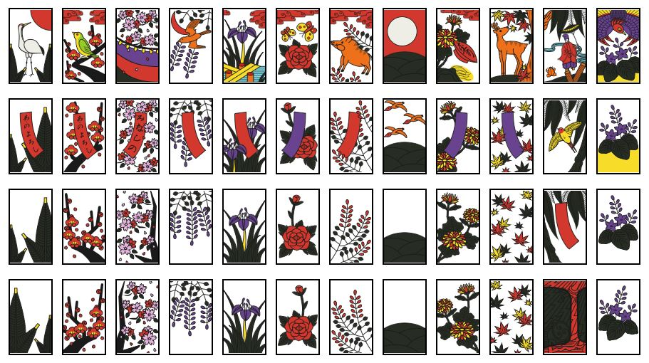
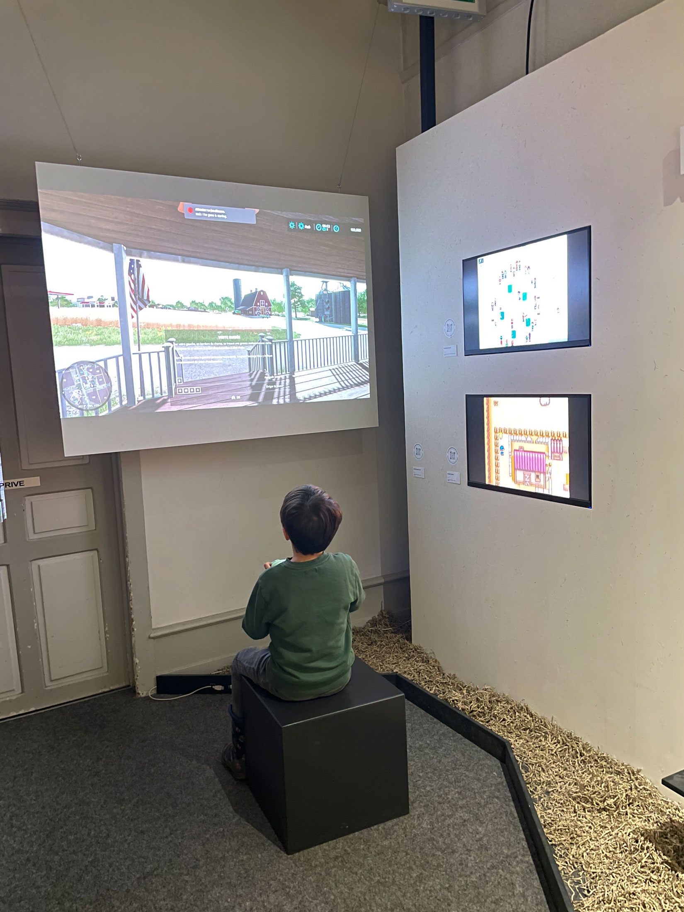

# Maria SARAFI

## Research 
My research examines the evolution of nature-themed playing cards, with emphasis on animal motifs. I focus primarily on the historical development of Japanese card games, tracing their origins from 8th century precursors to the 19th-20th century Hanafuda decks. In parallel, I explore the European card decks, concentrating on the evolution of Tarot (Tarot de Marseille, Rider–Waite Tarot, and contemporary variations), especially their Major Arcana or Trump cards and their unique designs. Finally, I look also into animal-themed card games for children.    
In terms of field research, I am targeting children aged 6+ together with their parents or grandparents. So far, I did a limited 1-hour observation in the Swiss Museum of Games, that I intend to expand to a larger and more representative sample.

### Insights

- Early playing cards (China, India, and later Mamluk deck) often carried symbolic imagery, including birds, flowers, and animals, as they were easier to recognize across cultures and social classes. When cards spread to Europe in the 14th century, animals symbolized specific virtues, and fate. For example, lions represented strength, birds freedom or fate, snakes
deceit. In the 17th–18th centuries, educational and moral card games were common. Decks often depicted plants, animals, or natural scenes to teach children about zoology, botany, or moral lessons.

Hanafuda Deck

    
<i>[See further Nature - Bestiary Cards Examples](https://drive.google.com/file/d/1DHTS5pODCRAs6sN-34fva-bKjNU4pooS/view?usp=share_link)</i>

- Animals evoke emotions; for example, a fox is seen as cunning, while a dog is considered loyal. They can make a game more appealing not only aesthetically but also in terms of relatability. For instance, in modern trading card games, creatures inspired by real or mythical animals make the game more immersive and engaging. 

  

  
  - A child experiments, showing a preference for video games and tactile devices such as joysticks. Their attention quickly shifts to something new, but they remain engaged longer when the game interests them.
  - Parents tend to control the content and duration of their child's activities.
  

  

## Koi-Koi*

Koi-koi is a collaborative interactive experience where the players immerse themselves in the history of animal-themed card games by choosing a specific animal card and producing the corresponding card design sound. Sounds can be produced through voice, hand gestures, or other body movements. The goal is to produce, through iteration, a standard deck based on four animal suits and three royal-animal cards.

There is a continuous cycle of life in nature, just as there is a continuous cycle of new sounds and decks feeding the installation. Beyond the educational aspect—learning about card games and their geographical, historical, and symbolic representations of animals, and understanding how a standard card deck is created—there is also a creative dimension. Participants can produce sounds themselves or listen to sounds produced by others. Finally, the experience highlights our connection to nature and animals: how we relate to them, why we are drawn to a specific animal, and what emotions or memories they evoke.

<i>*Koi-Koi is inspired by the homonymous Japanese Hanafuda card game, where players aim to form special card combinations called "yaku" to score points and must decide whether to continue (koi-koi) playing.</i>

## Keywords
- Continuous cycle of life in nature
- Humans and Nature
- Animals Symbolism
- Memory and Emotion
- Sounds and Gestures
- Accessibility 
- Ecological Footprint

## User Journey
<!---->

## Novel Combinations
1. Animal Card
2. Produce a Sound
3. Story
4. Loop 1-3
5. Deck