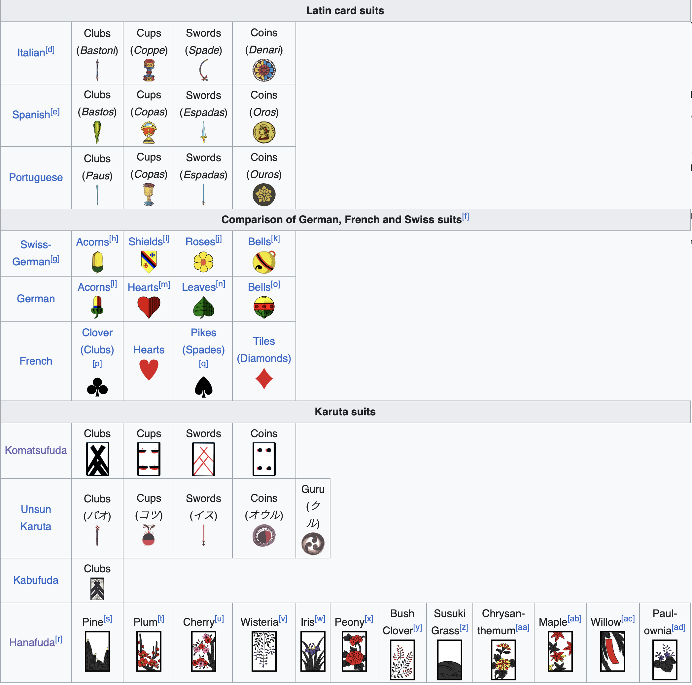

# Kostas KATKEVICIUS and Maria SARAFI
## Research
Our research examines the symbolism of suits, focusing primarily on European and European-inspired four-suit card decks, including Tarot cards.

### Insights

1. <b>Suits.</b> Depending on the deck’s origin, different suit symbols and varying numbers of suits have been used. In European and European-inspired standard decks, there are typically four suits. 

 

  
   
  <em><a href="https://en.wikipedia.org/wiki/Playing_card_suit" target="_blank"> <i>Card Decks Suits</i></a></em>  

 

Tarot cards use the Italian suits of swords, cups, coins, and batons (bastoni) or wands. 

  <table>
    <tr>
      <td align="center">
         
      </td>
      <td align="center">
         
      </td>
      <td align="center">
         
      </td>
      <td align="center">
         
      </td>
    </tr>
  </table>

  <em><a href="https://www.vam.ac.uk/articles/tarot-cards" target="_blank"> <i>Tarot Suits</i></a></em>  

 

2. <b>Seasons and the classical elements.</b> By 1582, the Gregorian calendar was largely adopted by Europe, so playing cards began to correlate with the year, the seasons, and the solstices. The four suits represent the four seasons/solstices or the four phases of the moon. Suits may also parallel the four elements found in nature: hearts for water, clubs for fire, diamonds for earth and spades for air. The twelve royals (King, Queen, and Jack), represent the twelve months of the year, each suit of thirteen cards represents the thirteen weeks in each season (<a href="https://www.artofplay.com/blogs/stories/the-symbology-of-playing-cards" target="_blank"> <i>The Symbology of Playing Cards</i></a>).

Before 1873 and the adaptation of the Gregorian calendar, the Japanese calendar was based on the Chinese solar-lunar calendar, which took into account the movements of both the Earth around the Sun, and the Moon around the Earth. Hanafuda cards are organized in twelve suits that correspond to months of the year, each month represented with a flowering plant (<a href="https://hanafudahawaii.com/2025/03/10/symbols-and-motifs-in-hanafuda/" target="_blank"> <i>Symbols and Motifs in Hanafuda</i></a>).

In tarot the suits represent the four elements – swords (thoughts or air), cups (emotions or water), coins/pentacles (material aspects or earth), and batons/wands (actions or fire) (<a href="https://www.vam.ac.uk/articles/tarot-cards" target="_blank"> <i>A history of tarot cards</i></a>). 

3. <b>Social classes and emotions.</b> Suits have been associated also to social classes, hearts or cups symbolized the clergy, diamonds or coins represented the merchant class and wealth, spades or swords stood for the nobility/aristocracy or the warrior class, and clubs or wands symbolized the peasantry or those who worked the land. 

Drawing on the suits’ social symbolism and their hypothesized emotional associations with social classes, a matrix can be established that links each suit to a corresponding set of emotions.

 

  
   
  <em><a href="https://vipspades.com/blog/the-meaning-of-playing-cards-symbols/" target="_blank"> <i>Card Decks Suits</i></a></em>  

 

4. <b> Quatrums System. </b> Based on the above-mentioned correspondences between suits, seasons, and classical elements, as well as the associations between suits, social classes, and emotions, we applied a four-quatrums parameter system in our project (four suits, four seasons, four classical elements, four emotions): <i>[Suitscapes systematic tables](https://drive.google.com/file/d/18z85sQfDapjkoeGyl910SBx9AmlIa3dK/view?usp=share_link)</i>.

## Suitscapes

<i>Suitscapes</i> is an immersive audiovisual experience in which the user shuffles through the history of suits, exploring their associations with the seasons, the elements, and human emotions. A swipe transports the user into a seasonal landscape filled with that season’s suits. Tapping a “suit-friend” reveals its origin and a fun fact. Accompanied by this suit, they must recover the season's element. By recovering the element and performing the corresponding emotional gesture, they gain access to the next seasonal universe. At the end of the journey, after recovering all four elements, all suits reunite to celebrate, marking the completion of the player’s quest. 

## Keyword
Symbolism

## User Journey
<i>[User Journey](./Images/User-Journey-KM.jpg)</i>

## Novel Combinations

- Suitscapes
- Swipe
- Immersive Experience